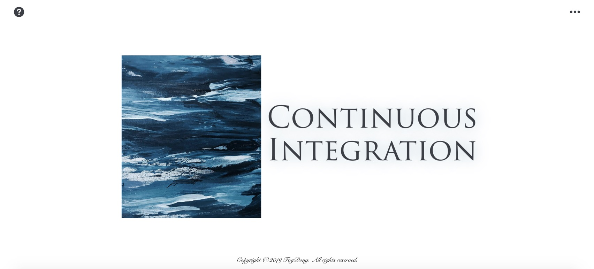
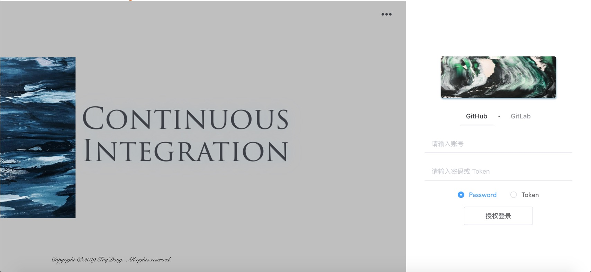
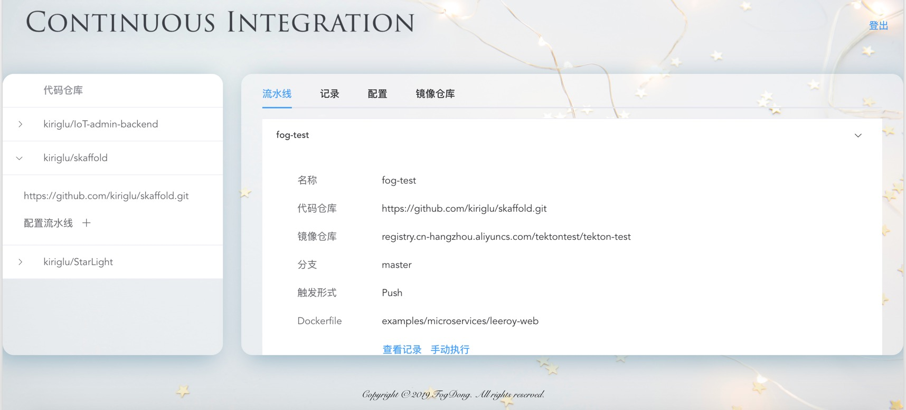
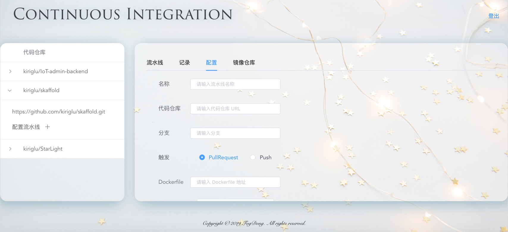
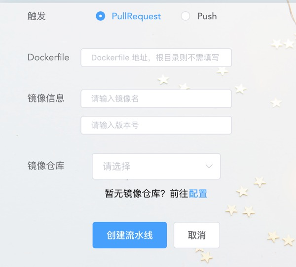
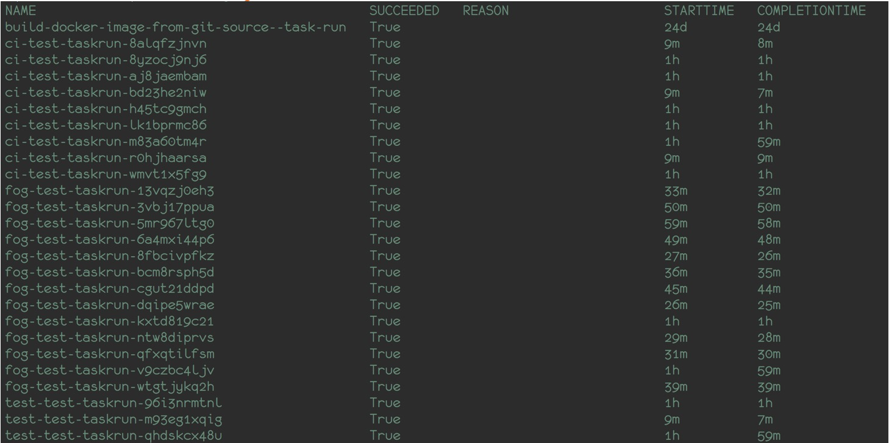
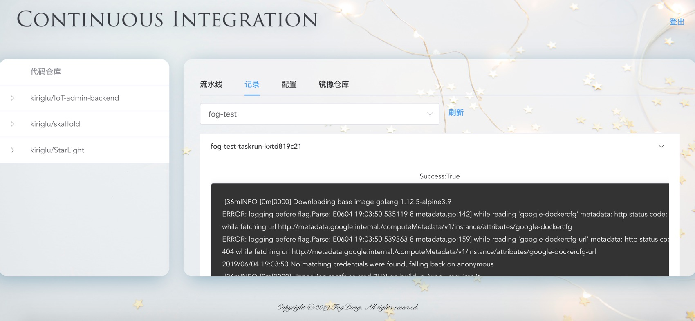
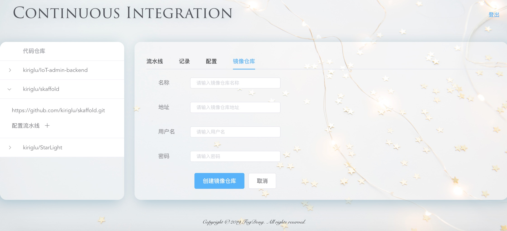
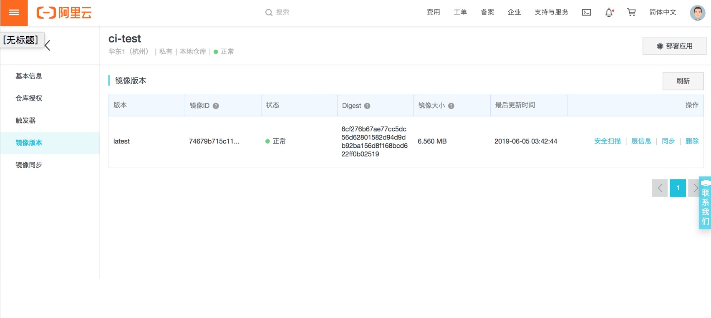

# TektonCI-Platform

A CI platform based on tekton
一个基于 tekton 和 kubernetes 的持续集成平台
~~其实是我的毕设~~

Frontend: Vue
Backend: Go + Gin
代码在陆续整理 ~~咕咕咕~~
（咕咕咕 咕咕咕 决定不把代码开源了，后端的逻辑主要就是调用 tekton 的 client 做 pipeline，因为写的比较早，所以用的 tekton 版本比较老，目前 tekton 的版本发展的比较快，所以后端就不开源啦~）

首页：大概是做的最好看的一个页面了。因为是第一个做的页面（。

授权登录（其实 gitlab 登录没做

授权登录后，左侧是仓库列表，默认将进入流水线查看页面，可以看到多条流水线配置。点击展开可以看到详细配置信息，并且可以查看流水线记录，更新、删除该配置以及直接手动执行该流水线。
可以看到页面逐渐变丑（

在配置中，可通过指定名称，代码仓库，分支，触发方式，Dockerfile 地址以及镜像仓库来配置流水线。名称将会是 Tekton 中 Task 的名称，同时，每次触发流水线都会自动生成 TaskRun，而 TaskRun 的名称则是此处填写的名称加上随机数。

会通过选择的触发方式（如 PullRequest），自动触发流水线并生成记录

可在集群中看到对应资源

在流水线的记录中，可具体点击某条流水线记录以查看日志

此外，还可以配置镜像仓库。配置完镜像仓库后，仓库会出现在流水线配置的镜像仓库列表中。

镜像推送成功

